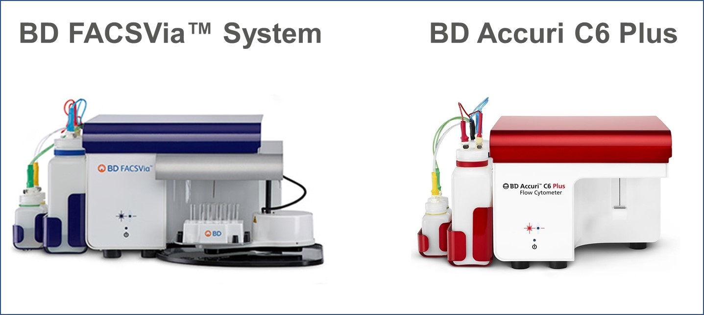
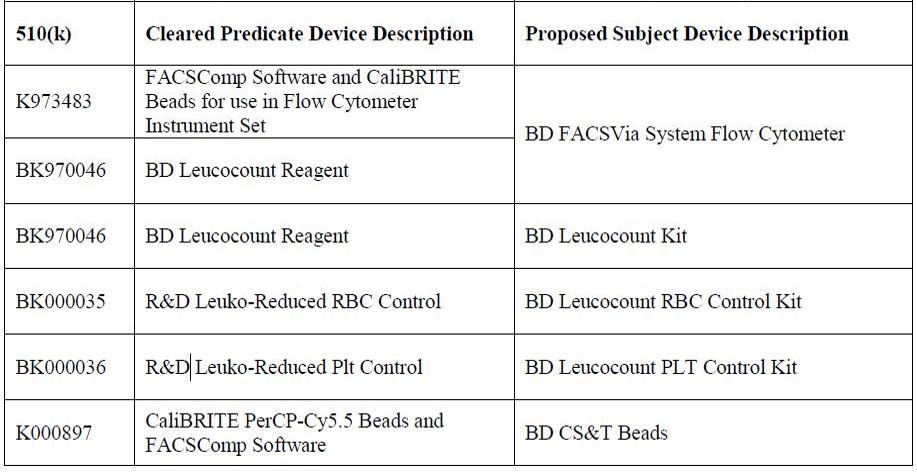

返回[ 至 **根目录**](../../../README.md)

返回[ 至 **流式主题**](../facscontent.md)

# BD FACSVia™ System
## 介绍

同一款机器，应用于科研的叫BD Accuri™ C6 Plus，应用于临床的叫BD FACSVia™ System，所以是一对双胞胎，晒张双胞胎的照片：

当然，作为一台临床诊断用的仪器当然有自己的特点：

（1）多了一套临床软件BD FACSVia™ Clinical Software；

（2）拥有配套的临床诊断试剂盒（见下图）

图注：左列为BD FACSCalibur™配套试剂，右列为BD FACSVia™ System配套试剂。

## 了解更多：

（1）.510(k)BD FACSVia™ System with BD Leucocount Reagent Assay: http://pan.baidu.com/s/1c1FhLTI

 解释： 可以清晰的看到他的市场定位——替代BD FACSCalibur™。

（2）.BD FACSVia™ 产品说明书:http://pan.baidu.com/s/1gfBUcAf

（3）. http://www.bdbiosciences.com/eu/instruments/clinical/cell-analyzers/bd-facsvia/m/3694812/overview

 解释： 通过BD bioscience Europe website了解更多。